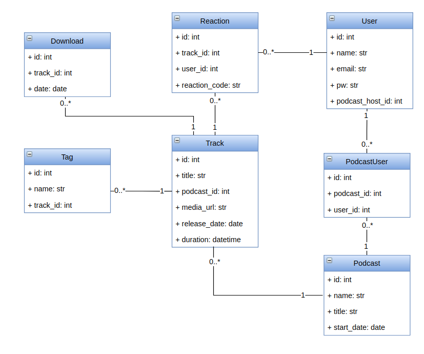

# podcaststore-flask

This is a back-end API written in Python with Flask and sqlalchemy to allow users to access a podcast store. In this podcast store, there are podcasts, tracks, users, tags, and users should be able to express a reaction to any track. This back-end is not completed yet, but it was reimplemented in Flask to be compared with [podcaststore-django](https://www.github.com/viniarck/podcaststore-django).

### Database UML diagram

Based on the [API and back-end requirements](./docs/api_requirements.md), the following UML relational diagram will be implemented:

